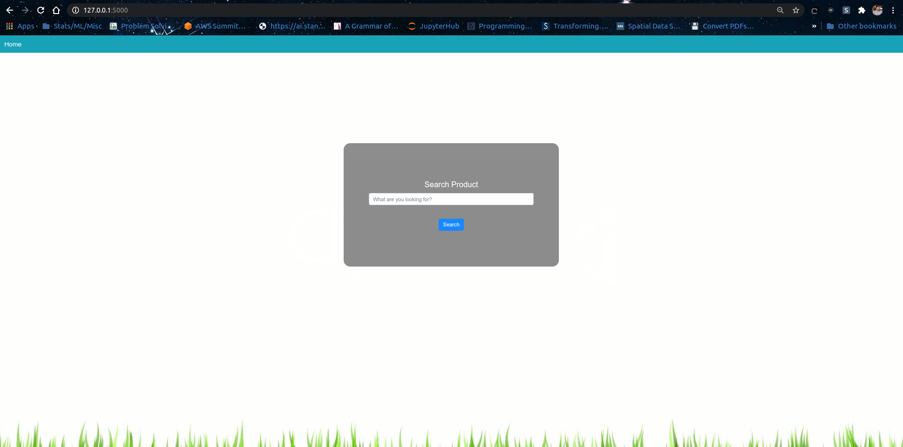
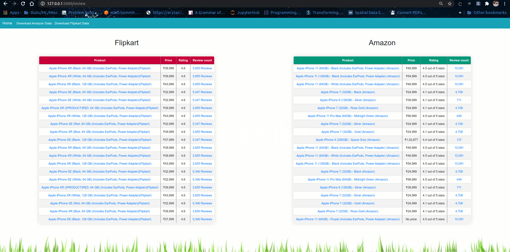
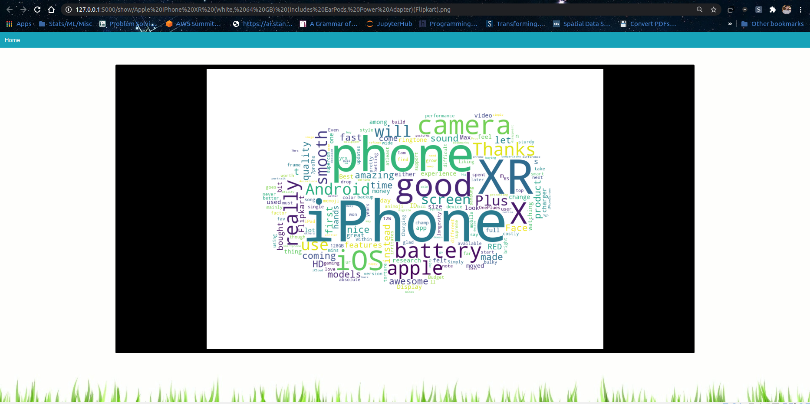

# Ecommerce Scraper 

Have you ever needed to go through multiple e-commerce websites simultaneously to check the price of the same product? Prices can differ but having a list side by side would be a bonus, wouldn't it?

Reviews can be confusing too, one product has 5 stars with only 10 reviews whereas another product of the same kind has fewer stars but more reviews. Which one shall you spend on?

This application can do them both. Show listings from Amazon and Flipkart, side by side, and show a word cloud representation of the reviews.

This is the homepage of the application.

This is where you can see the search results.

If you click on any of the reviews after the search has been completed you will land on this page. The wordcloud is available for each and every
product, provided there is at least 1 or more reviews.

If you wish to replicate the same on your system download the bin file, it contains the virtual environment (venv). 
All the dependencies are mentioned in the requirements.txt.

Note : Since the query is running simultaneously and then building a wordcloud for each product it takes a lot of time.

Thank you for your time!
